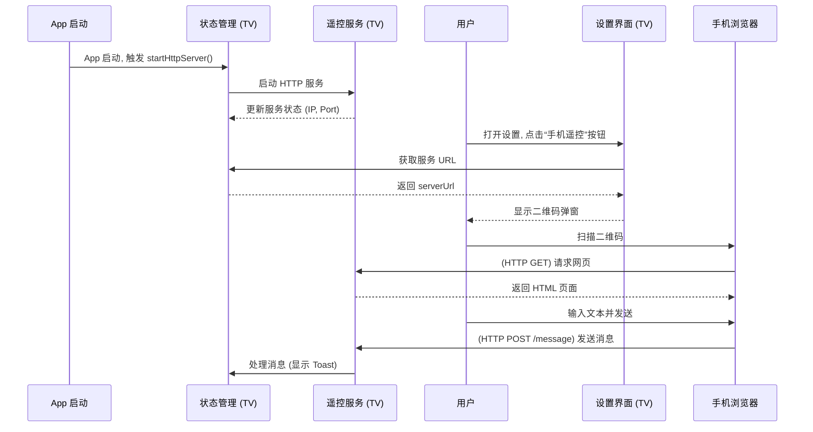

# 手机遥控功能实现方案 (V2)

本文档详细描述了在 OrionTV 应用中集成一个基于 **HTTP 请求** 的手机遥控功能的完整方案。

---

## 1. 核心功能与流程

该功能允许用户通过手机浏览器向 TV 端发送文本消息，TV 端接收后以 Toast 形式进行展示。服务将在应用启动时自动开启，用户可在设置中找到入口以显示连接二维码。

### 流程图



---

## 2. 技术选型

*   **HTTP 服务**: `react-native-http-bridge`
*   **二维码生成**: `react-native-qrcode-svg`
*   **网络信息 (IP 地址)**: `@react-native-community/netinfo`
*   **状态管理**: `zustand` (项目已集成)

---

## 3. 项目结构变更

### 新增文件

*   `services/remoteControlService.ts`: 封装 HTTP 服务的核心逻辑。
*   `stores/remoteControlStore.ts`: 使用 Zustand 管理远程控制服务的状态。
*   `components/RemoteControlModal.tsx`: 显示二维码和连接信息的弹窗组件。
*   `types/react-native-http-bridge.d.ts`: `react-native-http-bridge` 的 TypeScript 类型定义。

### 修改文件

*   `app/_layout.tsx`: 在应用根组件中调用服务启动逻辑。
*   `components/SettingsModal.tsx`: 添加“手机遥控”按钮，用于触发二维码弹窗。
*   `package.json`: 添加新依赖。

---

## 4. 实现细节

### a. 状态管理 (`stores/remoteControlStore.ts`)

创建一个 Zustand store 来管理遥控服务的状态。

*   **State**:
    *   `isServerRunning`: `boolean` - 服务是否正在运行。
    *   `serverUrl`: `string | null` - 完整的 HTTP 服务 URL (e.g., `http://192.168.1.5:12346`)。
    *   `error`: `string | null` - 错误信息。
*   **Actions**:
    *   `startServer()`: 异步 action，调用 `remoteControlService.startServer` 并更新 state。
    *   `stopServer()`: 调用 `remoteControlService.stopServer` 并更新 state。

### b. 服务层 (`services/remoteControlService.ts`)

实现服务的启动、停止和消息处理。

*   **`startServer()`**:
    1.  使用 `@react-native-community/netinfo` 获取 IP 地址。
    2.  定义一个包含 `fetch` API 调用逻辑的 HTML 字符串。
    3.  使用 `react-native-http-bridge` 在固定端口（如 `12346`）启动 HTTP 服务。
    4.  配置 `GET /` 路由以返回 HTML 页面。
    5.  配置 `POST /message` 路由来接收手机端发送的消息，并使用 `Toast` 显示。
    6.  返回服务器 URL。
*   **`stopServer()`**:
    1.  调用 `httpBridge.stop()`。

### c. UI 集成

*   **`app/_layout.tsx`**:
    *   在根组件 `useEffect` 中调用 `useRemoteControlStore.getState().startServer()`，实现服务自启。
*   **`components/SettingsModal.tsx`**:
    *   添加一个 `<StyledButton text="手机遥控" />`。
    *   点击按钮时，触发 `RemoteControlModal` 的显示。
*   **`components/RemoteControlModal.tsx`**:
    *   从 `remoteControlStore` 中获取 `serverUrl`。
    *   如果 `serverUrl` 存在，则使用 `react-native-qrcode-svg` 的 `<QRCode />` 组件显示二维码。
    *   如果不存在，则显示加载中或错误信息。

### d. 网页内容 (HTML)

一个简单的 HTML 页面，包含一个输入框和一个按钮。

```html
<html>
  <head>
    <title>OrionTV Remote</title>
    <meta name="viewport" content="width=device-width, initial-scale=1.0">
    <style> /* ... some basic styles ... */ </style>
  </head>
  <body>
    <h3>发送消息到 TV</h3>
    <input id="text" />
    <button onclick="send()">发送</button>
    <script>
      function send() {
        const val = document.getElementById("text").value;
        if (val) {
          fetch("/message", {
            method: 'POST',
            headers: { 'Content-Type': 'application/json' },
            body: JSON.stringify({ message: val })
          });
          document.getElementById("text").value = '';
        }
      }
    </script>
  </body>
</html>